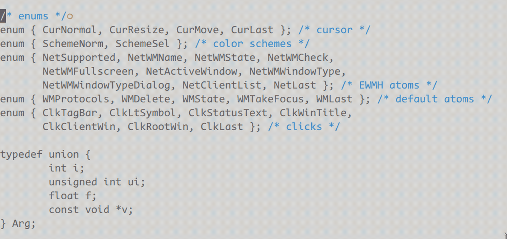

eolmark.nvim - display end-of-line mark at current cursor line

# demo



i prefer using block cursor, but i often find it tricky to distinguish whether the character under the cursor at the end of a line is space or eol

the `listchars` option is a great solution, but enabling it to show eol marks for every line creates visual clutter that distracts me while editing

this plugin was created to address that problem by showing a subtle, single-line marker (using virtual text) for eol — just where it matters, at the cursor line

# setup

## setup example 1:

```
require("eolmark").setup()
```

this uses default settings, which is equivalent to:

```
require("eolmark").setup({
	excluded_filetypes = {},
	excluded_buftypes = {},
	opts = {
		virt_text = {{"○", "NonText"}},
		virt_text_pos = "overlay",
		right_gravity = false,
		hl_mode = "combine",
		priority = 0,
	},
})
```

## setup example 2:

```
require("eolmark").setup({
	opts = {
		virt_text = {{"❤️", "Normal"}},
	},
})
```

this displays the mark as `❤️` with `Normal` highlight group, leaves everything else as default

the `opts` table is the last parameter of `nvim_buf_set_extmark` function, see `:help nvim_buf_set_extmark` for details

## setup example 3:

```
require("eolmark").setup({
	excluded_filetypes = {
		"c",
		"lua",
	},
	excluded_buftypes = {
		".+",
	},
	opts = {
		virt_text = {{"love and peace", "NonText"}},
	},
})
```

this displays the mark, but only when:
1. the `filetype` is neither `c` nor `lua`
2. the `buftype` does not match lua pattern `.+`, which means the `buftype` must be an empty string

## setup example 4:

if you are using `lazy.nvim`:

```
{
	"aidancz/eolmark.nvim",
	lazy = false,
	config = function()
		require("eolmark").setup()
	end,
}
```
